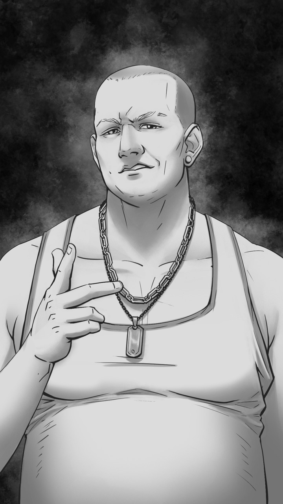

# Alan

| Caractéristiques   | Alan                        |
| ------------------ | --------------------------- |
| Nom                | -                           |
| Référence          | Turing                      |
| Age                | 20 (1996)                   |
| Taille             | 1.78                        |
| Crime annoncé      | Violences, trafic de drogue |
| Raison réelle      | Maltraitait Isaac à l'école |
| Métier             | -                           |
| Caractère          | Rebelle                     |
| Arme               | Sa force physique           |
| Bombe              | Coeur                       |
| Atout comme alliée | Sa force physique           |
| Liens annoncés     | Leonhard (juge)             |

## Tel qu’il est vu par le joueur

Petit bandit local, musclé ou plutôt trapu. Il a les traits assez anguleux, carrés mais n’est pas « sec » comme Erwin. Il est un peu gros, cliché typique du « bully » du collège.

Il avoue au début du jeu avoir frappé un de ses professeurs et avoir vendu du cannabis (l'herbe, pas en résine) au lycée et de la cocaïne plus récemment. Cela en fait un personnage violent mais franc, honnête dans un certain sens. Il n’éprouve toutefois pas tellement de remords pour ses crimes.

## Background / Réalité (potentiellement découvert)

Enfant, il était pourri/gâté par des parents riches et plus préoccupés par leur travail que leur vie de famille. Au collège, il frappait les plus faibles, dont Isaac. Il cache cette information aux autres pendant le Jeu mais le comportement d’Isaac rend cela visible et évident aux yeux de tous. Par la suite, il rencontre Leonhard, qui va le juger pour ses mauvaises actions. Alan est libéré grâce à la caution que ses parents acceptent de payer. Johann, qui s’intéresse déjà aux affaires de son oncle, va s’intéresser de près à Alan, qui va (contre toute attente) devenir son dealer. Pendant le jeu, c’est surtout Johann, en reconnaissant son dealer, qui va s’intéresser à Isaac en comprenant leur relation. C’est grâce à Alan que Johann comprend l’identité du Bourreau, (même s’il ne comprend pas son tour de passe-passe de l’acte III/IV), et non Leonhard, qui était pourtant au courant de son identité.

## Description physique

Assez grand, des muscles cachés sous une légère couche de graisse résultante de son addiction aux barres chocolatées et aux sodas. Aussi massif que Erwin mais beaucoup moins 'taillé en V'. Il a un marcel un peu trop grand pour lui. Il a les cheveux rasés de près et un rictus de défi permanent.

