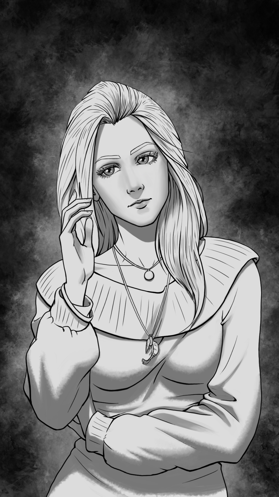

# Emmy

| Caractéristiques   | Emmy                                         |
| ------------------ | -------------------------------------------- |
| Nom                | -                                            |
| Référence          | Noether                                      |
| Age                | 15 (2001)                                    |
| Taille             | 1.61                                         |
| Crime annoncé      | Aucun (innocente ?)                          |
| Raison réelle      | Fait partie de G.M. et ressemble à Isaac     |
| Métier             | Étudiante                                    |
| Caractère          | Fragile                                      |
| Arme               | Petite lame (dague)                          |
| Bombe              | TODO                                         |
| Atout comme alliée | Connait des informations sur certains persos |
| Liens annoncés     | Isaac (collège)                              |

## Telle qu’elle est vue par le joueur

Frêle, elle n’a clairement pas l’air à sa place dans cet endroit. C’est la seule fille du Jeu au début, et également la seule mineure: elle semble très vulnérable. Élégante mais discrète et associable, elle fascine les garçons de son âge qui n’osent pas l’approcher. Elle a souvent les sourcils froncés.

## Background / Réalité (potentiellement découvert)

Elle recommença sa vie dans une petite ville allemande, où se déroule l’histoire de Coalescence. Elle est sous la tutelle de l’organisation Gesunder Menschenverstand de Lise et Erwin.

## Description physique

Emmy est petite, blonde et jolie. Élégante, elle ressemble à une première de classe. Elle a 15 ans, ce qui en fait le personnage le plus jeune du Jeu.C’est une fille vraiment jolie. Dans le sens plus «belle» que «mignonne», ses traits étant plus fins que ronds. Elle est blonde et aime porter des habits de petite fille sage. Malgré cela, elle a un visage déterminé et un peu «fermé». Elle n’est pas du genre à se laisser faire, contrairement à ce qu’elle veut laisser paraître (elle joue de sa situation). Elle ressemble plutôt à Isaac, version «fille».

