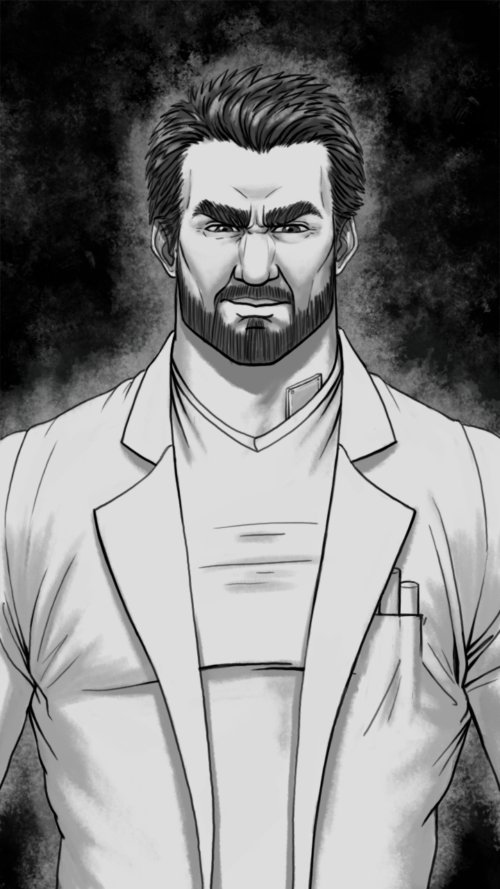

# Erwin

| Caractéristiques   | Erwin                    |
| ------------------ | ------------------------ |
| Nom                | -                        |
| Référence          | Schrödinger              |
| Age                | 35 (1981)                |
| Taille             | 1.93                     |
| Crime annoncé      | Accident chimique mortel |
| Raison réelle      | Est le Rossignol         |
| Métier             | Chimiste                 |
| Caractère          | Dur                      |
| Arme               | Laboratoire (poison)     |
| Bombe              | TODO                     |
| Atout comme alliée | Sait arrêter la Créature |
| Liens annoncés     | Lise (femme)             |

## Telle qu’il est vu par le joueur

Il a un physique impressionnant. Moralement, c'est une glace : il fait extrêmement peur. Il ne ressent jamais de sentiments, à part la haine froide. C’est le personnage le plus impressionnant du jeu, car il allie intelligence et force. Il agit comme s’il était supérieur aux autres, mais pas parce qu’il se *croit* *supérieur* (contrairement à Johann) : parce qu’il *sait* les autres *inférieurs*.

Il a tout de même de nombreux points faibles : sa femme Lise (beaucoup moins forte et intelligente que lui), sa gorge (recouverte de métal, lié au fait que sa voix est métallique), et son inhumanité.

## Background / Réalité (potentiellement découvert)

Il se révèle en fait être le Nightingale/Rossignol, qui a castré de force une centaine d’homosexuels, leur donnant une voix aigüe, et leur forçait à réciter des chants religieux (d’où le nom de Rossignol, oiseau à la voix remarquable).

Sa gorge métallique est en fait un modificateur de voix, pour la rendre plus grave et inquiétante. En réalité, sa voix est aussi aigue qu’un castrat, et pour cause…

Tout son être, sa forme physique, aussi bien que son intelligence ou ses actes barbares découlent d’un seul évènement. Il a lui-même été castré de force durant sa jeunesse. Le traumatisme a été tel qu’il est uniquement mu par le désir de vengeance. Il veut montrer le meilleur de lui-même et écraser les autres sur tous les domaines. Il a en fait beaucoup de lien avec le Bourreau, mais ce dernier ignore cette partie de sa vie et lui en veut juste d’agresser des homosexuels.

## Description physique

Erwin est grand, très grand. Il est aussi très musclé, même si sa puissance est cachée par une couche de graisse qui lui donne l’air d’être un joueur de rugby. En le voyant, on ne dirait pas un intello travaillant dans un laboratoire mais plutôt un malfrat sortant de prison L’appareil métallique lui sort discrètement de la gorge.

