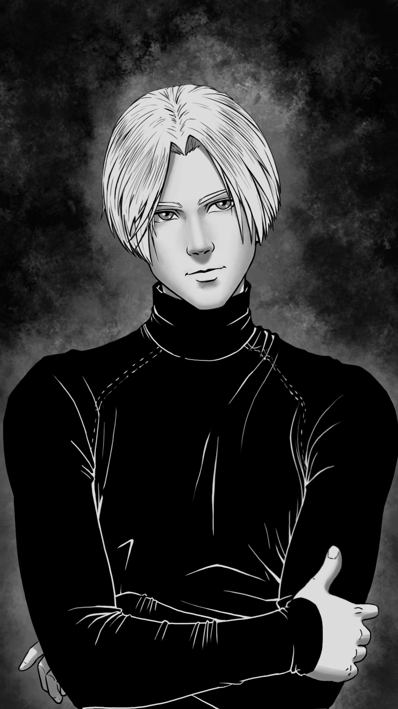

# Isaac

|   Caractéristiques | Isaac                           |
| -----------------: | ------------------------------- |
|                Nom | -                               |
|          Référence | Newton                          |
|                Age | 18 (1998)                       |
|             Taille | 1.78                            |
|      Crime annoncé | Aucun (innocent ?)              |
|      Raison réelle | -                               |
|             Métier | Étudiant en informatique        |
|          Caractère | Espiègle                        |
|               Arme | Couteau                         |
|              Bombe | Bras gauche                     |
| Atout comme alliée | Peut se sacrifier à notre place |
|     Liens annoncés | Emmy (collège)                  |

## Tel qu’il est vu par le joueur

Il est frêle, aussi bien physiquement que moralement. Il a peur du Bourreau plus que quiconque. On le sent sur la défensive à l’approche d’Alan, il est sous-entendu que ce dernier le battait au collège.

Il agit assez régulièrement de manière assez féminine, ce qui laisse à penser qu’il est homosexuel.

Il a l’air suicidaire, et peut effectivement se sacrifier à la place du joueur.

## Background / Réalité (potentiellement découvert)

C’est lui le Bourreau. Voir le fichier « Chronologie » qui relate la les évènements qui se passent dans le jeu et avant.

## Description physique

C’est le jumeau version fille d’Emmy. Plus grand, et avec des traits un peu plus marqués qu’elle, car il est plus âgé de 3 ans. 

Il a tout de même des traits très féminins, et porte un col roulé.

