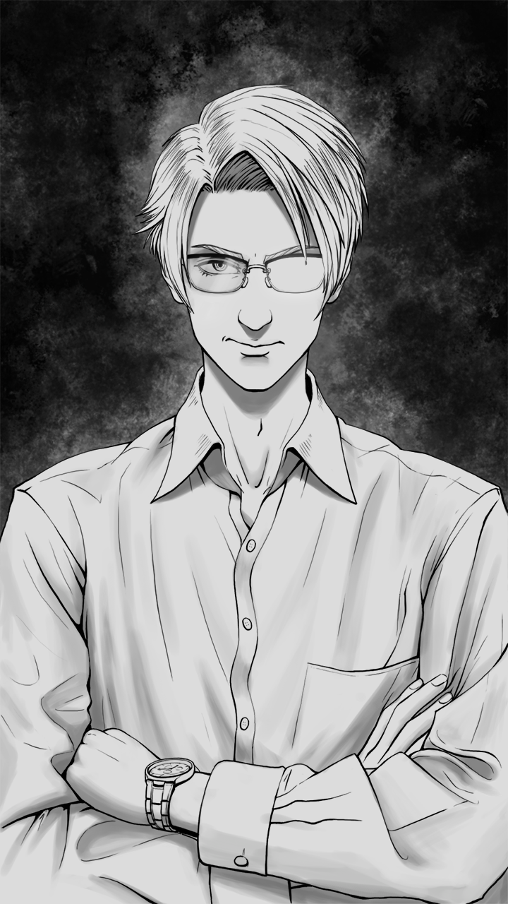

# Johann

| Caractéristiques   | Johann                            |
| ------------------ | --------------------------------- |
| Nom                | -                                 |
| Référence          | Kepler                            |
| Age                | 24 (1992)                         |
| Taille             | 1.80                              |
| Crime annoncé      | Triche à un examen                |
| Raison réelle      | Enquête sur le Bourreau           |
| Métier             | Étudiant en droit                 |
| Caractère          | Intelligent, Nerveux, Prétentieux |
| Arme               | Pointe cachée dans ses lunettes   |
| Bombe              | Bassin                            |
| Atout comme alliée | Intelligence                      |
| Liens annoncés     | Aucun                             |

## Telle qu’il est vu par le joueur

C’est un personnage arrogant, sûr de lui et avec un léger côté malade mental, obsédé par la Vérité. Il remet tout en question et c’est clairement le personnage qui donne le plus de fil à retordre au Bourreau. Ses interventions font d’ailleurs souvent penser que c’est lui le Bourreau.

Je le vois un peu comme Sherlock Holmes dans l’histoire puisqu’il fait avancer l’enquête.

## Background / Réalité (potentiellement découvert)

C’est lui l’innocent du Jeu dont parle le Bourreau. En réalité, il n’est pas si innocent parce que son oncle Leonhard l'a pistonné pour qu’il ait son école de droit, mais le Bourreau ne lui en tient pas rigueur : il est de toute façon très brillant ! Il adore les énigmes et est profondément excité par le Jeu du Bourreau. Ce dernier savait que Johann enquêtait sur lui et Grace. A vrai dire, c’est pour cela que le Bourreau l’a choisi pour participer à son dernier Jeu : il avait besoin d’un public qui connait ses pratiques et qui saura apprécier la façon dont il déploie sa haine. Et il a eu raison.

Il adore enquêter et réfléchir : les énigmes, c’est son truc. Il aide d’ailleurs volontairement le FBI depuis une affaire dans laquelle il a été impliqué. C’est lui qui remet en doute Grace.

## Description physique

Blond, grand, droit, des lunettes. Il à l'air sûr de lui, limite arrogant.

