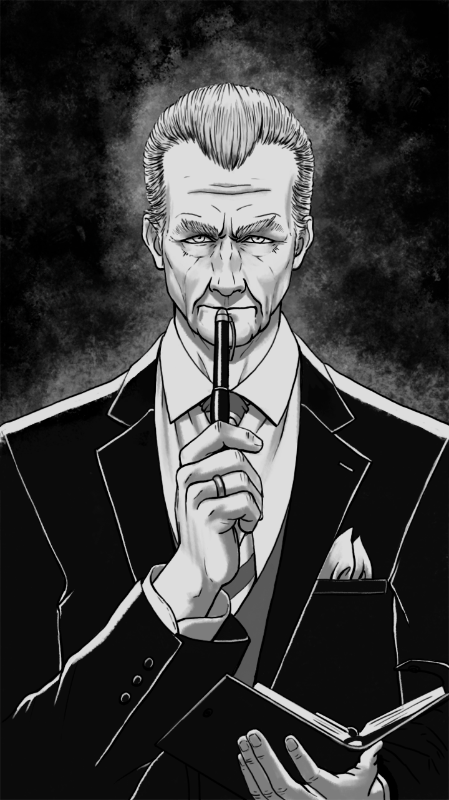

# Leonhard

|   Caractéristiques | Leonhard                |
| -----------------: | :---------------------- |
|                Nom | Newer                   |
|          Référence | Euler                   |
|                Age | 53 (1963)               |
|             Taille | 1.75                    |
|      Crime annoncé | Corruption              |
|      Raison réelle | Enquête sur le Bourreau |
|             Métier | Agent du FBI            |
|          Caractère | Froid                   |
|               Arme | Stylo plume             |
|              Bombe | TODO                    |
| Atout comme alliée | Connaissance / Indices  |
|     Liens annoncés | -                       |

## Tel qu’il est vu par le joueur

Il est froid, stoïque et a l’air au-dessus de tout. C’est comme s'il était en décalage, détaché de la situation dans laquelle le joueur est. Il n’est pas inquiété outre mesure par la gravité des évènements.

## Background / Réalité (potentiellement découvert)

Leonhard a fait exprès de rentrer dans le Jeu du Bourreau. Il travaille sur l’affaire du Hibou (a pris le relai de Grace Hopper) et a provoqué le Bourreau dans le but de le faire réagir.

## Description physique

Leonhard a un look d'aristocrate. En costume 3 pièces, la cinquante-soixantaine. Les cheveux courts et blancs/gris, rabattus vers l'arrière

